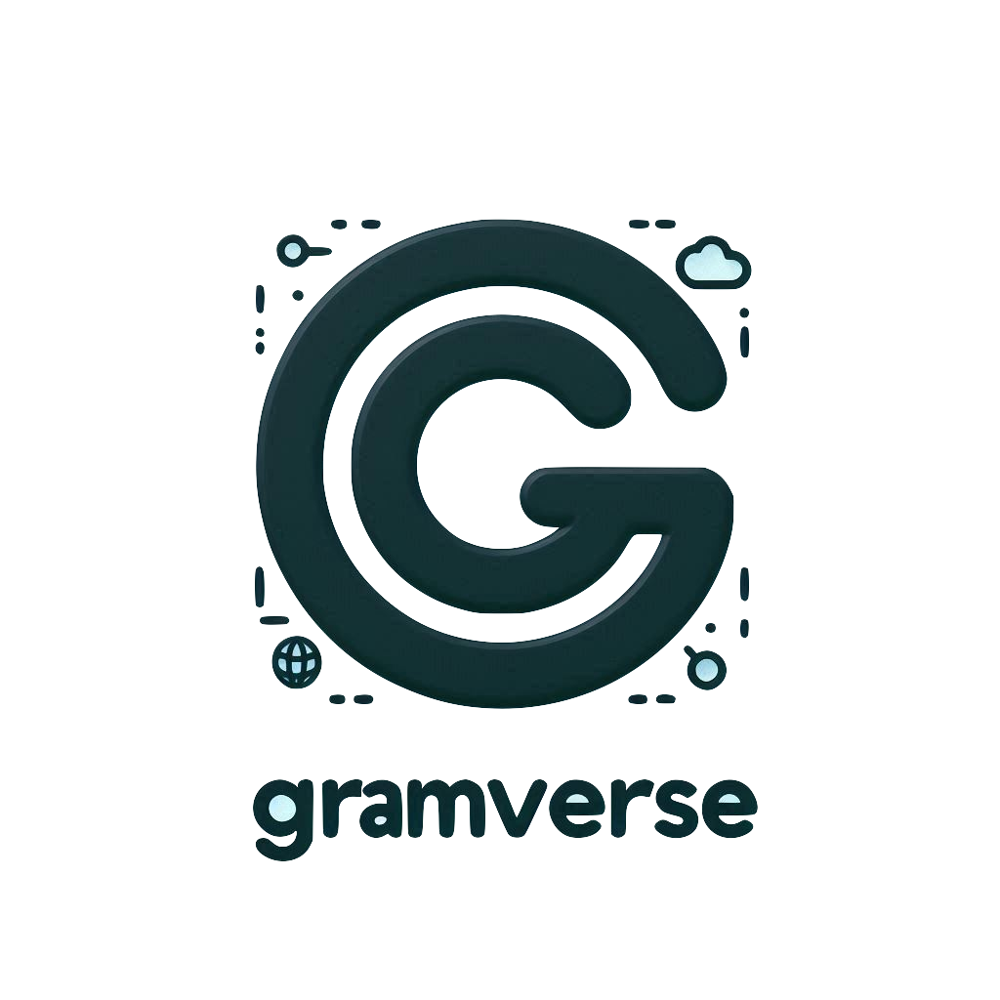

<p align="center">
  
  
</p>

   

# 🚀 Gramverse Social Media Web Application

## 📖 Table of Contents
- [About](#about)
- [Features](#features)
- [Technologies Used](#technologies-used)
- [Getting Started](#getting-started)
  - [Installation](#installation)
  - [Usage](#usage)
- [Contact](#contact)
- [Collaborators](#collaborators)

## 🌟 About
Gramverse is a unique Persian Social Media Web App designed specifically for Persian-speaking users. It provides a comfortable and culturally relevant space for users to connect, share, and interact in their native language. With a user-friendly interface and features tailored to the Persian community, our app bridges the gap in social networking for Persian speakers worldwide. Gramverse is fully responsive, offering both web and mobile versions to ensure a seamless experience across all devices.

## 🎉 Features
- User authentication and profiles
- Post creation and sharing
- Real-time messaging
- Friend/follower system
- Close friends list
- Black list functionality
- User blocking capabilities
- Post saving feature
- Multiple account switching
- Explore page
- Privacy settings
- Hashtag and mention support
- Photo sharing
- Comment and like system
- Responsive design (web and mobile versions)

## 💻 Technologies Used
- Frontend: 
  - React
  - React Query
  - React Router DOM
  - Tailwind CSS
  - Zod
  - React Hook Form
- Backend: Node.js
- Database: MongoDB

## 🚀 Getting Started

### Installation
1. Clone the repo
   ```
   git clone https://github.com/gramverse/gramverse-frontend.git
   ```
2. Install NPM packages
   ```
   npm install
   ```
## 🖥 Usage


## 👥 Collaborators

<p align="center">
    <a href="https://github.com/reyhaneh-k" style="text-decoration: none; color: black;">
      
    </a>
    <a href="https://github.com/ghazalmoghadam" style="text-decoration: none; color: black;">
      
    </a>
    <a href="https://github.com/hamidakhavan21" style="text-decoration: none; color: black;">
      
    </a>
    <a href="https://github.com/AlirezaIzadi6" style="text-decoration: none; color: black;">
      
    </a>
    <a href="https://github.com/alimhp021" style="text-decoration: none; color: black;">
      
    </a>
</p>
